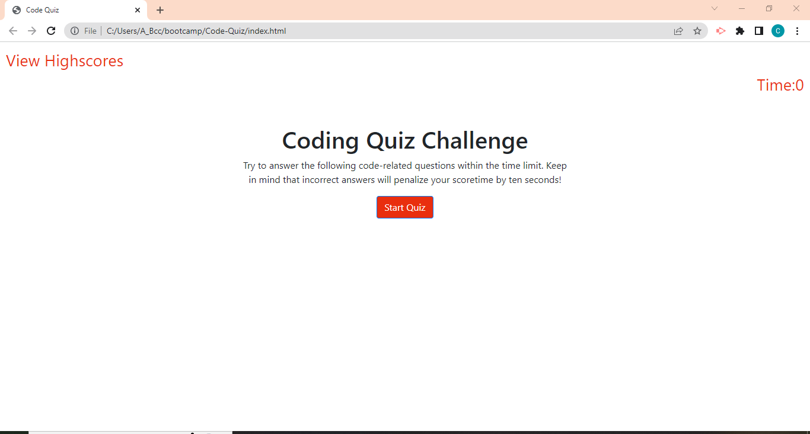

# Web APIs: Code Quiz

## Description

Building a timed coding quiz with multiple-choice questions by utilizing dynamic HTML and CSS powered by JavaScript.

## Installation

N/A

## Usage

If you would like to download the code, here are the steps:
 - clone the repository 
 - open the folder in your IDE
 - to execute javascript, open the html in the browser

 also, to take quiz directly, follow next link:

 https://luffykun20.github.io/Code-Quiz/

 
 

## Credits

Bootstrap

https://getbootstrap.com/docs/4.3/getting-started/introduction/

## License

MIT

